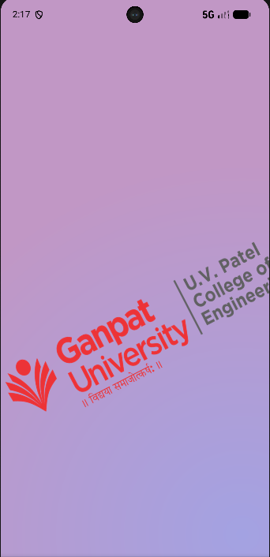
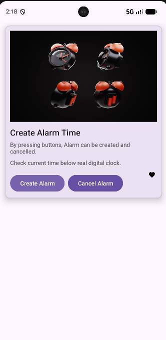

# 🎬 Practical 6 — Android Animations & Splash Screen

> **Aim:** To develop an Android application demonstrating **Frame-by-Frame Animation, Splash Screen Animation, and Twin/Tween Animation** using Kotlin and XML.

---

## 📌 Introduction

This practical demonstrates different animation techniques available in Android development.

The application contains an animated splash screen followed by a main screen containing animated UI elements. Frame-by-frame animation is implemented using `AnimationDrawable`, while the splash screen also uses a Twin/Tween animation loaded through `AnimationUtils`.

### Main Features

- Frame-by-frame animation
- Animated splash screen
- Twin/Tween animation
- Alarm-clock animation
- Heart animation
- `AnimationDrawable`
- `AnimationUtils`
- `AnimationListener`
- Window focus based animation control
- Edge-to-Edge display

---

## 📂 Project Structure

```text
24012011013_Mad_pr6/
│
├── app/
│   └── src/
│       └── main/
│           ├── java/
│           │   └── com/example/
│           │       └── a24012011013_mad_pr6/
│           │           ├── MainActivity.kt
│           │           └── SplashActivity.kt
│           │
│           ├── res/
│           │   ├── anim/
│           │   ├── drawable/
│           │   ├── layout/
│           │   └── values/
│           │
│           └── AndroidManifest.xml
│
├── gradle/
├── .gitignore
├── build.gradle.kts
├── gradle.properties
├── gradlew
├── gradlew.bat
├── settings.gradle.kts
└── README.md
```

---

# 🎞️ Frame-by-Frame Animation

Frame-by-frame animation works by displaying a series of images one after another. Each image acts as an individual frame of the animation.

In this project, Android's:

```text
AnimationDrawable
```

is used to control the sequence of frames.

The animation frames and their timing are defined using an XML `animation-list` resource.

---

# ⏰ Alarm Animation

The main screen contains an animated alarm-clock image.

Multiple alarm images are placed inside the `drawable` resources and are connected through:

```text
alarm_animation_list.xml
```

The animation list contains the individual frames and specifies how long each frame should remain visible.

### Animation Flow

```text
Alarm Frame 1
      ↓
Alarm Frame 2
      ↓
Alarm Frame 3
      ↓
     ...
      ↓
Alarm Frame 10
      ↓
   Repeat
```

The animation is configured to continue repeating instead of stopping after one cycle.

---

# ❤️ Heart Animation

A second frame animation is used for the heart icon on the main screen.

The heart drawable frames represent different stages of the heart animation:

```text
ic_heart_0.xml
ic_heart_25.xml
ic_heart_50.xml
ic_heart_75.xml
ic_heart_100.xml
```

These frames are controlled through:

```text
heart_animation_list.xml
```

### Heart Animation Sequence

```text
0%
 ↓
25%
 ↓
50%
 ↓
75%
 ↓
100%
 ↓
Repeat
```

This demonstrates how vector drawables can also be used as frames in an Android animation.

---

# 🏠 MainActivity

`MainActivity.kt` is responsible for displaying the main application screen and starting the alarm and heart animations.

The alarm animation is attached to an `ImageView` using:

```kotlin
alarm.setBackgroundResource(
    R.drawable.alarm_animation_list
)
```

The drawable is then converted into an `AnimationDrawable`:

```kotlin
alarmanimation =
    alarm.background as AnimationDrawable
```

The same technique is applied to the heart animation:

```kotlin
heart.setBackgroundResource(
    R.drawable.heart_animation_list
)

heartanimation =
    heart.background as AnimationDrawable
```

---

# 👁️ Handling Window Focus

The application uses:

```kotlin
onWindowFocusChanged()
```

to control the animations.

When the Activity receives window focus:

```kotlin
alarmanimation.start()
heartanimation.start()
```

When the Activity loses focus:

```kotlin
alarmanimation.stop()
heartanimation.stop()
```

Therefore, the animations are active while the application window is in focus.

---

# 🌈 Splash Screen

The application starts with a separate:

```text
SplashActivity.kt
```

The splash screen displays the UVPCE logo with an animated effect before opening the main application.

The splash layout is:

```text
activity_splash.xml
```

The logo is displayed using an `ImageView`.

---

# 🎞️ Splash Frame Animation

The splash logo uses another `AnimationDrawable`.

The animation resource is assigned to the logo using:

```kotlin
imglogo.setBackgroundResource(
    R.drawable.uvpce_animation_list
)
```

It is then converted into an `AnimationDrawable`:

```kotlin
guniframeanim =
    imglogo.background as AnimationDrawable
```

This allows the UVPCE logo to change through multiple frames during the splash screen.

---

# ✨ Twin/Tween Animation

Along with the frame animation, the splash screen uses a Twin/Tween animation.

The animation is loaded from:

```text
res/anim/twin_animation.xml
```

It is loaded in Kotlin using:

```kotlin
gunianim = AnimationUtils.loadAnimation(
    this,
    R.anim.twin_animation
)
```

An animation listener is then attached:

```kotlin
gunianim.setAnimationListener(this)
```

This allows the application to detect when the splash animation has completed.

---

# 🔄 Application Animation Flow

The overall working of the application can be represented as:

```text
              App Starts
                  │
                  ▼
           SplashActivity
                  │
                  ▼
          Splash Screen UI
                  │
          ┌───────┴───────┐
          ▼               ▼
    Frame Animation   Twin/Tween
          │               │
          └───────┬───────┘
                  ▼
          Animation Finished
                  │
                  ▼
            MainActivity
                  │
          ┌───────┴───────┐
          ▼               ▼
     Alarm Animation  Heart Animation
```

After the splash animation finishes, the application starts `MainActivity`.

---

# 🔔 Animation Listener

`SplashActivity` implements:

```kotlin
Animation.AnimationListener
```

The `onAnimationEnd()` method is used to open the main screen after the animation finishes.

```kotlin
override fun onAnimationEnd(animation: Animation?) {
    Intent(this, MainActivity::class.java)
        .also { startActivity(it) }
}
```

Thus, the user automatically moves from the splash screen to the main application screen.

---

# ⏯️ Starting the Splash Animation

The splash frame animation is started when the Activity receives window focus:

```kotlin
override fun onWindowFocusChanged(hasFocus: Boolean) {
    super.onWindowFocusChanged(hasFocus)

    if (hasFocus) {
        guniframeanim.start()
        imglogo.startAnimation(gunianim)
    } else {
        guniframeanim.stop()
    }
}
```

This controls both the frame animation and the Twin/Tween animation.

---

# 🖼️ Animation Resources

The project uses different drawable and animation resources.

### Animation XML Files

```text
res/anim/twin_animation.xml

res/drawable/alarm_animation_list.xml
res/drawable/heart_animation_list.xml
res/drawable/uvpce_animation_list.xml
```

### Main Drawable Resources

```text
alarm1.jpg
alarm2.jpg
...
alarm10.jpg
```

### Heart Vector Frames

```text
ic_heart_0.xml
ic_heart_25.xml
ic_heart_50.xml
ic_heart_75.xml
ic_heart_100.xml
```

---

# 📚 Concepts Demonstrated

| Concept | Usage in Project |
|---|---|
| `ImageView` | Displays images and animation content |
| `AnimationDrawable` | Creates frame-by-frame animation |
| `animation-list` | Stores animation frames |
| `onWindowFocusChanged()` | Starts and stops animations |
| `AnimationUtils` | Loads the Twin/Tween animation |
| `AnimationListener` | Monitors animation events |
| `onAnimationEnd()` | Opens `MainActivity` |
| Splash Screen | Provides an animated startup screen |
| Vector Drawable | Used for heart animation frames |
| Edge-to-Edge | Used for modern screen layout |

---

# 🛠️ Implementation Steps

1. Create the Android Studio project.
2. Create the main application layout.
3. Add `MainActivity`.
4. Create `SplashActivity`.
5. Design the splash screen layout.
6. Add the alarm animation frames.
7. Create `alarm_animation_list.xml`.
8. Add the heart vector drawable frames.
9. Create `heart_animation_list.xml`.
10. Create the UVPCE splash animation list.
11. Create `twin_animation.xml`.
12. Load the animations using Kotlin.
13. Use `AnimationDrawable` for frame animations.
14. Control animation using `onWindowFocusChanged()`.
15. Implement `Animation.AnimationListener`.
16. Open `MainActivity` after the splash animation ends.
17. Run the application and verify all animations.

---

# ▶️ How to Run the Project

1. Open the project in **Android Studio**.
2. Wait for Gradle synchronization to complete.
3. Connect an Android device or start an emulator.
4. Run the application.
5. The animated splash screen will appear first.
6. Wait for the splash animation to complete.
7. `MainActivity` will open.
8. Check the alarm-clock animation.
9. Check the heart animation.
10. Move the application out of focus and return to it to observe the animation behavior.

---

# 🖼️ Output

### Splash Screen

```text

```

### Main Screen

```text

```


# 📁 Important Files

### Kotlin Files

```text
MainActivity.kt
SplashActivity.kt
```

### Layout Files

```text
activity_main.xml
activity_splash.xml
```

### Animation Files

```text
res/anim/twin_animation.xml

res/drawable/alarm_animation_list.xml
res/drawable/heart_animation_list.xml
res/drawable/uvpce_animation_list.xml
```

### Animation Frames

```text
alarm1.jpg ... alarm10.jpg

ic_heart_0.xml
ic_heart_25.xml
ic_heart_50.xml
ic_heart_75.xml
ic_heart_100.xml
```

---

# ✅ Result

The Android application was successfully implemented to demonstrate **Frame-by-Frame Animation, Splash Screen Animation, and Twin/Tween Animation**.

The practical uses Kotlin, XML animation resources, `AnimationDrawable`, `AnimationUtils`, and `AnimationListener` to create and control the animations.

The application successfully displays the animated splash screen and then navigates to the main screen containing the alarm and heart animations.
